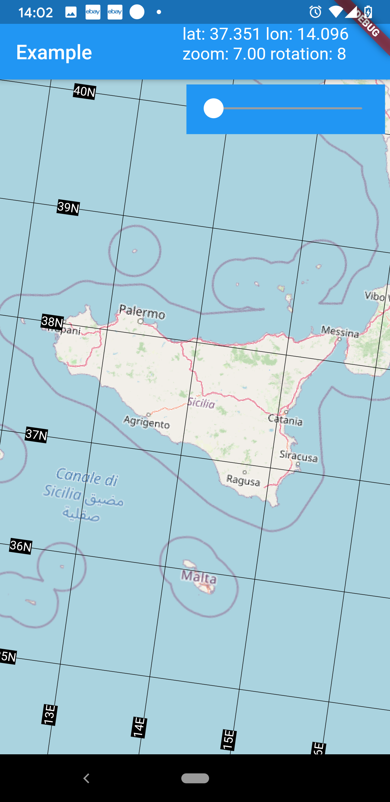

[](https://pub.dev/packages/lat_lon_grid_plugin)

# lat_lon_grid_plugin

Adds a latitude / longitude grid as plugin to the [flutter_map](https://github.com/johnpryan/flutter_map/).

# Getting Started

Example application under `/example/`:



# Usage

```yaml
dependencies:
  flutter_map: any
  lat_lon_grid_plugin: any
```

Include the `FlutterMap` into your widget tree.

```dart
  FlutterMap(
    mapController: _mapController,
    options: MapOptions(
      center: LatLng(51.814, -2.170),
      zoom: 6.15,
      rotation: 0.0,
    ),
    children: [
      TileLayer(
        urlTemplate:
            'https://{s}.tile.openstreetmap.org/{z}/{x}/{y}.png',
        subdomains: ['a', 'b', 'c'],
      ),
      LatLonGridLayer(
        options: LatLonGridLayerOptions(
          lineWidth: 0.5,
          // apply alpha for grid lines
          lineColor: Color.fromARGB(100, 0, 0, 0),
          labelStyle: TextStyle(
            color: Colors.white,
            backgroundColor: Colors.black,
            fontSize: 12.0,
          ),
          showCardinalDirections: true,
          showCardinalDirectionsAsPrefix: false,
          showLabels: true,
          rotateLonLabels: true,
          placeLabelsOnLines: true,
          offsetLonLabelsBottom: 20.0,
          offsetLatLabelsLeft: 20.0,
        ),
      ),
    ],
  ),
```
